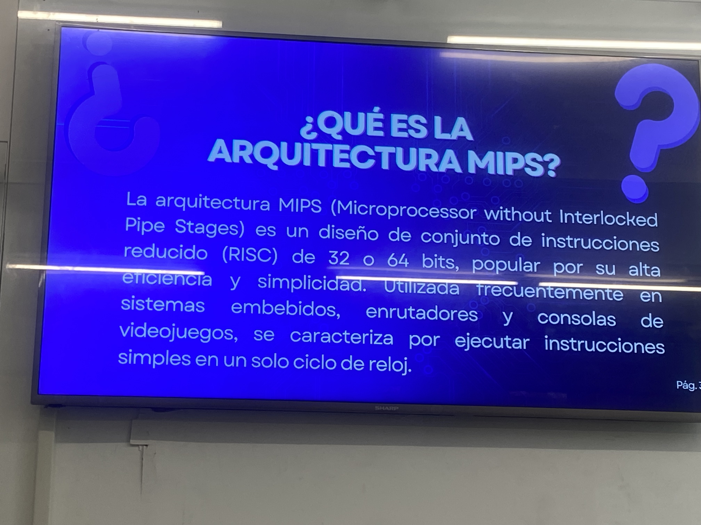

# Smart-Text-Editor

This project is a desktop text editor built with Qt (C++) that includes features such as file management, customizable UI themes, and OCR (Optical Character Recognition) to extract text from images using Python and Tesseract.

Initially I decided to developed it to simplify my student life by allowing me to convert whiteboard photos into editable text for homework and study purposes.

I plan to continue improving it by adding more features focused on academic use.

\---

List of Features:

* Create, open, edit and save text files
* Export documents as PDF
* Font customization (bold, italic, underline, font selection)
* Multiple UI themes (light, dark, pink, blue, green, yellow)
* Convert images to text using OCR

\---

OCR Integration

This project integrates a Python-based OCR system using the Tesseract library.

The C++ application executes an external .exe generated from Python using QProcess, allowing the interaction between Qt and Python.

\---

Technologies Used

C++ (Qt Framework)

Python (Pytesseract, PIL)

Tesseract OCR

PyInstaller (to generate executable from Python script)

\---

Demo Gif

&#x20; 

Image Used

&#x20; 

\---

Notes

The OCR feature depends on Tesseract, which must be installed on the system.

The Python script is compiled into an executable using PyInstaller.

The project avoids hardcoded Python dependencies by using a standalone .exe.

